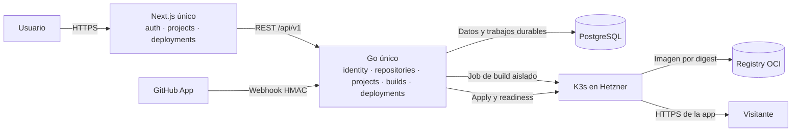
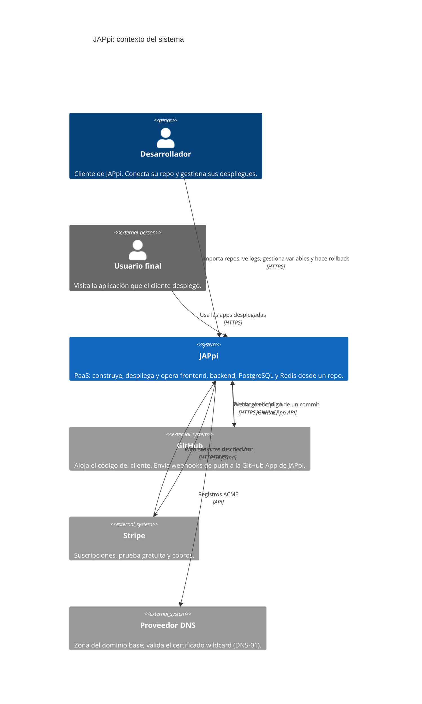
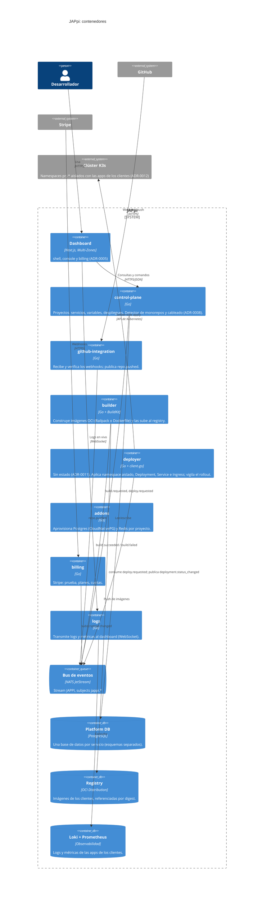
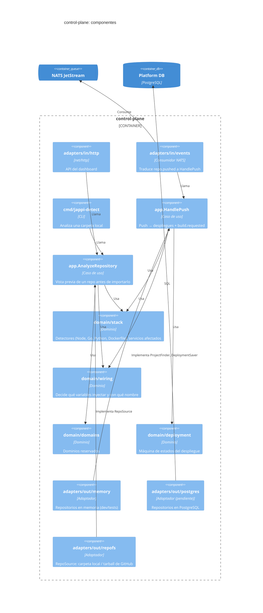
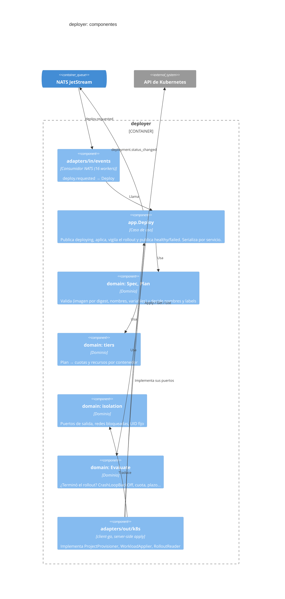
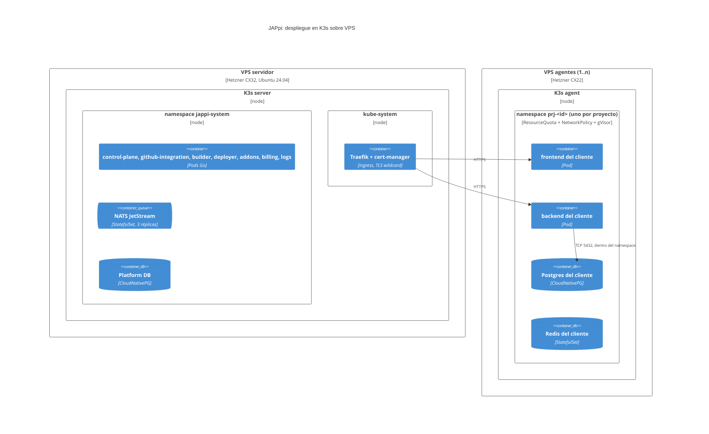
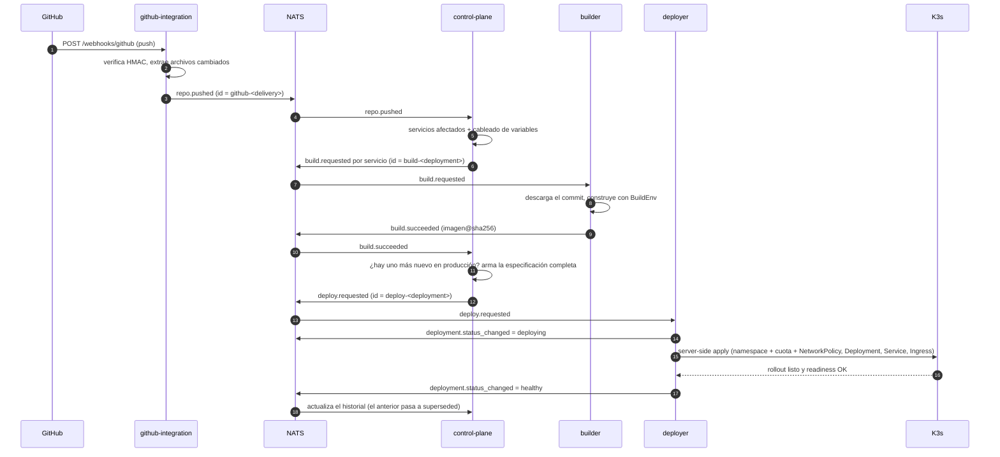

# Arquitectura C4 de JAPpi

Modelo [C4](https://c4model.com) en cuatro niveles de zoom. Los diagramas están en Mermaid, así que GitHub los renderiza directamente y se editan como texto en el mismo PR que cambia la arquitectura.

> **Regla:** si un PR añade un servicio, un contenedor, un sistema externo o una relación nueva, actualiza el diagrama correspondiente en el mismo PR.

> **Lectura temporal:** los diagramas detallados de `control-plane`, `deployer` y NATS más abajo describen el código actual o la antigua propuesta distribuida. El objetivo de la etapa 1 es el siguiente diagrama; la migración no está implementada todavía. Ver [ADR-0013](../adr/0013-monolito-modular-hasta-validar-el-producto.md) y [Sprint 3](../roadmap.md).

## Objetivo de la etapa 1 · dos monolitos modulares

El backend ejecuta un solo proceso público con API y trabajador; el trabajo de clientes corre en Jobs aislados de K3s. Los módulos internos se llaman por interfaces Go y comparten transacciones PostgreSQL. La app Next.js es un solo artefacto. La separación en microservicios y Multi-Zones es una decisión posterior basada en mediciones, no una dependencia del golden path.

---

## Nivel 1: contexto del sistema

Quién usa JAPpi y con qué sistemas externos habla.

---

## Nivel 2: contenedores del diseño distribuido anterior

Este diagrama conserva el diseño de microservicios y Multi-Zones como referencia histórica y posible punto de partida para la etapa 2. Algunas piezas existen en el repositorio; `builder`, `addons`, `billing`, `logs` y la UI de varias zonas siguen pendientes. No representa el despliegue objetivo del Sprint 3.

---

## Nivel 3: componentes del control-plane

El hexágono del servicio central (ADR-0006). Las flechas apuntan siempre hacia dentro: los adaptadores dependen de `app`, y `app` depende de `domain`.

---

## Nivel 3: componentes del deployer

Un hexágono sin estado (ADR-0011). Todas las decisiones de aislamiento y límites están en el dominio; el adaptador k8s solo traduce.

---

## Nivel 4: despliegue distribuido anterior

Diseño previo (ADR-0004). Diego documentará y verificará el despliegue del monolito en Hetzner durante el Sprint 3; este esquema no debe usarse como inventario de infraestructura ya instalada.

---

## Flujo dinámico del diseño distribuido anterior: de un push a producción

