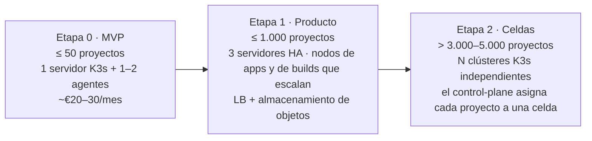

# System Design de JAPpi

Este documento responde a **cómo escala JAPpi**:
- cuánta carga esperamos;
- qué pieza se rompe primero;
- cómo crece cada componente;
- qué prometemos (SLO) y cuánto cuesta cada plan.

El C4 ([docs/c4](c4/README.md)) muestra **qué** piezas hay y los ADR explican **por qué**; este documento cuantifica. Se revisa en cada cambio de etapa (ver la [sección 8](#8-etapas-de-crecimiento)) o cuando un número real contradiga una estimación.

> **Los números son estimaciones de orden de magnitud**, hechas antes de tener usuarios. Cada supuesto está escrito para poder cambiarlo y recalcular. Los precios de Hetzner son de referencia y hay que verificarlos.

---

## 1. Requisitos

### Funcionales

| # | Requisito |
|---|-----------|
| F1 | Conectar un repo de GitHub y detectar sus servicios, incluso en monorepos |
| F2 | Cablear sin configuración las variables entre frontend, backend, Postgres y Redis |
| F3 | Construir y desplegar en cada push, solo los servicios afectados |
| F4 | Historial de despliegues, rollback y redeploy |
| F5 | Logs en vivo, estado de los servicios y reinicios |
| F6 | Variables de entorno editables desde el dashboard |
| F7 | Prueba de 30 días y suscripciones de $5, $12 y $20 con Stripe, con límites reales por plan |

### No funcionales

| Atributo | Objetivo |
|----------|----------|
| **Aislamiento** | Un proyecto no puede leer, afectar ni atacar a otro (ADR-0012) |
| **Escalabilidad** | De 1 a 1.000 proyectos sin rediseño; más de 5.000 con celdas (§8) |
| **Disponibilidad** | Ver los SLO (§6) |
| **Latencia** | Del push a la URL en menos de 3 min (p50) |
| **Coste** | Margen bruto mayor del 50 % en cada plan (§9) |
| **Operabilidad** | Tres personas deben poder operarlo: poco estado, todo declarativo e idempotente |
| **Durabilidad** | No perder un push ni un despliegue aunque se caiga un servicio |

---

## 2. Supuestos de carga

Horizonte de diseño: **1.000 proyectos activos a los 12 meses.**

| Supuesto | Valor | Motivo |
|----------|-------|--------|
| Servicios por proyecto | 4 (web, api, Postgres, Redis) | El caso típico que queremos resolver |
| Pushes por proyecto y día | 2 | Proyectos personales y de estudiantes, no equipos grandes |
| Servicios afectados por push | 1,5 | El redespliegue selectivo evita reconstruirlo todo |
| Duración de un build | 2 min con caché, 2 vCPU | Next.js/Node típico con caché de BuildKit |
| Factor de pico | ×3 | La actividad se concentra en horario laboral de Latinoamérica |
| Mezcla de planes (proyectos de pago) | 60 % hobby, 30 % pro, 10 % team | Supuesto a validar |
| Proyectos que pagan | 70 % (el resto en prueba) | Supuesto a validar |

---

## 3. Estimación de capacidad

### Builds: el recurso más caro en los picos

- **Volumen:** 1.000 proyectos × 2 pushes × 1,5 servicios = **3.000 builds al día**.
- **Tiempo total:** 3.000 × 2 min = 6.000 min, es decir, **100 horas de build al día**.
- **Concurrencia media:** 100 h / 24 h ≈ **4 builds a la vez**.
- **Concurrencia en pico:** ×3 ≈ **13 builds a la vez**, que son **26 vCPU y unos 52 GB de RAM**.

→ Hacen falta **nodos de build dedicados que escalen**: 0–4 nodos CX42 (8 vCPU), no nodos fijos.

### Eventos: NATS no es el cuello de botella

- **Volumen:** unos 7 eventos por despliegue × 3.000 = **21.000 eventos al día** ≈ 0,25/s de media y ~2/s en pico.
- **Capacidad:** un solo nodo de NATS procesa cientos de miles de mensajes por segundo.

→ Tenemos **más de 10.000 veces de margen**. El bus solo importa por durabilidad y disponibilidad (3 réplicas), no por capacidad.

### Apps de los clientes: la memoria manda

- **Pods:** 1.000 proyectos × 4 servicios = **~4.000 pods**, más los del rolling update.
- **Memoria pedida:** hobby 1 GiB, pro 2 GiB, team 4 GiB (ADR-0012).
  - Media ponderada: 0,6 × 1 + 0,3 × 2 + 0,1 × 4 = **1,6 GiB por proyecto de pago**.
  - Los proyectos en prueba piden 1 GiB.
- **Memoria total:** 700 × 1,6 + 300 × 1 ≈ **1,4 TiB**.
  - En el peor caso (cada proyecto usa toda su cuota): ~220 nodos CX32 (~6,5 GiB utilizables cada uno).
  - Con un uso real del 40 % de la cuota: **~90 nodos**.

→ **La memoria de los clientes es el coste dominante y el cuello de botella nº 1** (§5).

### Observabilidad

- **Logs:** ~10 KB/min por pod × 4.000 pods ≈ 57 GB/día sin comprimir; en Loki, comprimidos unas 10 veces, ≈ **6 GB/día**. Con 7 días de retención en hobby, **~40 GB**.
- **Métricas:** ~50 series por pod × 4.000 pods = **200.000 series activas**. Un solo Prometheus o VictoriaMetrics lo soporta.

### Almacenamiento

| Qué | Cálculo | Total | Dónde |
|-----|---------|-------|-------|
| Registry de imágenes | 2.000 servicios con imagen × 10 versiones × ~30 MB de capas únicas | **~600 GB** | Almacenamiento de objetos (S3) + recolector de imágenes viejas |
| Platform DB | ~1 KB por despliegue × 3.000 al día | ~1 GB al año | Postgres pequeño; no es un problema |
| Postgres de los clientes | Hasta la cuota del plan (5–50 GiB) | Variable | Volúmenes de bloque |

### Tráfico del dashboard

- **Carga:** ~200 usuarios a la vez × 1 petición cada 5 s ≈ **40 peticiones/s**.
- **Capacidad:** una réplica del control-plane en Go atiende miles por segundo; no es un problema.

---

## 4. Cómo escala cada componente

| Componente | ¿Guarda estado? | Cómo crece | Límite práctico | Qué hacemos al llegar al límite |
|------------|-----------------|------------|-----------------|---------------------------------|
| github-integration | No | Réplicas detrás del ingress | Miles de webhooks/s | Nada hasta la etapa 2 |
| control-plane | No; el estado está en la Platform DB | Réplicas. Todas comparten el consumidor durable de NATS, que reparte los mensajes entre ellas | La Platform DB | Réplicas de lectura para el dashboard; particionar por cuenta en la etapa 2 |
| builder | No; la caché es desechable | **Nodos dedicados que escalan según los builds en cola** (KEDA leyendo NATS) | Coste de CPU | Límite de builds simultáneos por plan: hobby 1, pro 2, team 4 |
| deployer | No (ADR-0011) | `Workers` por réplica (16), luego más réplicas | El orden por servicio (ver el cuello de botella 3) | Repartir los subjects por servicio |
| NATS JetStream | Sí (el stream) | Clúster de 3 réplicas | Muy por encima de lo necesario | Superclúster entre celdas en la etapa 2 |
| Platform DB | Sí | Vertical + réplicas de lectura (CloudNativePG) | Decenas de miles de escrituras/s | Una base de datos por celda |
| Ingress (Traefik) | No | Un Traefik por nodo detrás del balanceador de Hetzner | Muchos miles de peticiones/s por nodo | Más nodos de borde |
| Plano de control de K3s | Sí (etcd) | 3 servidores en alta disponibilidad | ~10.000 pods y ~2.000 namespaces cómodos | **Celdas** (otro clúster) |
| Apps de los clientes | Según el caso | Nodos que escalan por memoria pedida | Coste | Dormir las apps inactivas y usar un Postgres compartido para hobby (§5) |

---

## 5. Cuellos de botella, en orden

| # | Cuello de botella | Cuándo aparece | Mitigación | Estado |
|---|-------------------|----------------|------------|--------|
| 1 | **Memoria de las apps de los clientes** (coste) | Desde el primer día | Cuotas por plan (hecho); dormir apps hobby inactivas y despertarlas con la primera petición (KEDA HTTP o Sablier); sobreasignar memoria de forma medida | Cuotas ✅ · dormir ⬜ |
| 2 | **Un Postgres por proyecto** (CloudNativePG): ~200 MB de base por instancia | ~200 proyectos | **Postgres compartido** (una base de datos por proyecto) para hobby y trial; dedicado para pro y team | ⬜ ADR pendiente |
| 3 | **Orden y concurrencia de los despliegues del mismo servicio** | Al tener más de una réplica del deployer | Hoy: `Workers` + candado por servicio dentro de la réplica + el control-plane descarta builds viejos (ADR-0011). Siguiente paso: `jappi.deploy.requested.<shard>`, con shard = hash(servicio) mod N, un consumidor por shard y orden garantizado por servicio | Parcial ✅ |
| 4 | **Picos de builds** | ~300 proyectos | Nodos de build que escalan, caché de BuildKit en almacenamiento de objetos, límite de builds simultáneos por plan | ⬜ |
| 5 | **Webhooks perdidos:** GitHub **no reintenta solo** si respondemos con error | Con cualquier caída de NATS | NATS con 3 réplicas + un **reconciliador** cada 5 min que compara el último commit de cada rama con el último desplegado y dispara lo que falte | ⬜ |
| 6 | **Límites de emisión de Let's Encrypt** (50 certificados por semana y dominio) | Desde ~50 proyectos nuevos por semana | Certificado **wildcard** único (ADR-0009) | Diseñado ✅ |
| 7 | **Un solo servidor K3s** (punto único de fallo) | Desde el primer cliente de pago | 3 servidores con etcd embebido | ⬜ Etapa 1 |
| 8 | **Un nodo cae y las apps con 1 réplica se caen** | Siempre | Hobby: se acepta, con 1–3 min de reprogramación. Team: 2 réplicas repartidas entre nodos (falta añadir `topologySpreadConstraints`) | Parcial |
| 9 | **Crecimiento del registry** | ~6 meses | Almacenamiento de objetos + conservar las últimas N imágenes por servicio + recolector programado | ⬜ |

---

## 6. SLO

| Qué | SLI (cómo se mide) | Objetivo MVP | Objetivo etapa 1 |
|-----|--------------------|--------------|------------------|
| API del dashboard | % de peticiones sin error 5xx | 99,5 % mensual (3 h 39 min de margen de error) | 99,9 % |
| API del dashboard | Latencia p95 | < 300 ms | < 200 ms |
| Recepción de webhooks | Tiempo hasta responder a GitHub | p99 < 1 s (GitHub corta a los 10 s) | igual |
| Del push a la URL | Tiempo de `repo.pushed` a `healthy` | p50 < 3 min, p95 < 8 min | p50 < 2 min |
| Logs en vivo | Del stdout del pod a la pantalla | < 5 s | < 2 s |
| Apps de los clientes | Disponibilidad del ingress hacia la app | hobby sin garantía, pro 99,5 %, team 99,9 % | igual, con compensación |

**Política de margen de error:** si en un mes se agota el margen de un SLO, las funcionalidades nuevas esperan hasta recuperar la fiabilidad.

---

## 7. Fallos y cómo se recupera el sistema

| Si falla... | Efecto | Recuperación |
|-------------|--------|--------------|
| NATS (una réplica) | Nada visible | JetStream con 3 réplicas sigue funcionando |
| NATS (entero) | Los webhooks responden 503 | GitHub **no** reintenta: el **reconciliador** (cuello de botella 5) recupera los pushes perdidos |
| control-plane | El dashboard muestra error; los eventos esperan en NATS | Al volver, sus consumidores durables retoman donde lo dejaron |
| deployer durante un rollout | El rollout sigue en Kubernetes | NATS reentrega el mensaje; volver a aplicar es idempotente y la vigilancia se retoma |
| Platform DB | El dashboard y los consumidores fallan | NATS reintenta (hasta 5 veces con espera); CloudNativePG pasa a la réplica |
| Registry | Los builds nuevos fallan | Las apps ya desplegadas siguen, porque las imágenes están en caché en los nodos |
| Un nodo de apps | Los pods se reprograman en otro nodo | 1–3 min de caída para apps con 1 réplica |
| Un proyecto abusivo | Intenta acaparar recursos | Cuota + límites + gVisor + NetworkPolicy lo contienen (ADR-0012) |

### Consistencia entre servicios

- **Consistencia eventual** por eventos (ADR-0002). La base es la **idempotencia**: IDs de evento deterministas, `SaveIfAbsent`, server-side apply y `AdvanceTo`, que tolera eventos desordenados.
- **Outbox implícito:** el control-plane guarda y después publica. Si se cae entre los dos pasos, NATS reentrega el evento que lo originó y la publicación se repite; el ID fijo evita duplicados.
- **Cuidado:** los comandos que vengan del dashboard (rollback, redeploy) **no** vienen de un evento reintentable, así que necesitarán un **outbox transaccional** (una tabla `outbox` en la misma transacción, que un proceso aparte publica en NATS).

---

## 8. Etapas de crecimiento

**Celdas (etapa 2):** cada celda es un clúster K3s completo, con su deployer y sus nodos, y aloja hasta ~1.000 proyectos.

- **Cómo se reparte el trabajo:**
  - el control-plane guarda en qué celda vive cada proyecto;
  - publica en `jappi.deploy.requested.<celda>`, y el deployer de cada celda consume solo su subject.
- **Qué se gana:**
  - la caída de un clúster afecta solo a su celda (menor radio de explosión);
  - se pueden abrir celdas en otras regiones.
- **Qué cambia en el código:**
  - un campo `Cell` en el proyecto;
  - un sufijo en el subject.

  El resto del diseño (eventos, deployer sin estado) ya lo permite.

---

## 9. Modelo de costes por plan

Supuesto de peor caso: el proyecto usa toda la memoria de su cuota. Precios de referencia: nodo CX32 ~€7/mes para ~6,5 GiB utilizables (**~€1,1 por GiB al mes**), volumen ~€0,045/GB al mes, Stripe 2,9 % + $0,30.

| Plan | Precio | Memoria | Cómputo | Disco | Parte fija de la plataforma* | Comisión de Stripe | **Coste** | **Margen** |
|------|--------|---------|---------|-------|------------------------------|--------------------|-----------|------------|
| hobby | $5 | 1 GiB | ~$1,2 | ~$0,25 | ~$0,3 | $0,45 | **~$2,2** | **~$2,8 (56 %)** |
| pro | $12 | 2 GiB | ~$2,4 | ~$1,0 | ~$0,3 | $0,65 | **~$4,4** | **~$7,6 (63 %)** |
| team | $20 | 4 GiB | ~$4,8 | ~$2,3 | ~$0,5 | $0,88 | **~$8,5** | **~$11,5 (58 %)** |
| prueba (30 días) | $0 | 1 GiB | ~$1,2 | ~$0,25 | ~$0,3 | — | **~$1,75** | **−$1,75** |

\* Parte proporcional de: servidores K3s, NATS, Platform DB, observabilidad y registry.

**Conclusiones:**

1. **El plan de $5 es viable, pero con poco margen.** La comisión de Stripe se come el 9 %, así que dormir las apps inactivas (cuello de botella 1) y compartir Postgres (cuello de botella 2) suben su margen de forma directa.
2. **Cada prueba cuesta ~$1,75.** Con un 20 % de conversión, cada cliente de pago cuesta ~$9 en pruebas; eso se recupera en ~3 meses de hobby. Pedir tarjeta (ADR-0010) mejora esta cifra al reducir el abuso.
3. **Estas cifras son el peor caso.** Con el uso real (típicamente 30–50 % de la cuota), el margen sube bastante. Hay que medirlo en cuanto haya usuarios y recalcular la tabla.

---

## 10. Qué medimos

Sin estas métricas no se puede verificar este documento. Van en el servicio de métricas (fase 5), pero se instrumentan desde ya.

| Servicio | Métrica clave |
|----------|---------------|
| Todos | Peticiones, errores y latencia (señales RED); mensajes pendientes por consumidor de NATS |
| control-plane | Del push a `healthy` (histograma); despliegues por estado |
| builder | Builds en cola y en curso; duración; % de aciertos de caché |
| deployer | Rollouts en curso; duración; fallos por motivo (CrashLoopBackOff, ImagePullBackOff...) |
| Clúster | Memoria pedida frente a asignable por nodo; cuota usada por proyecto |
| Negocio | Pruebas → pago (%); coste real por plan frente a la tabla del §9 |

---

## 11. Preguntas abiertas

- ¿Postgres compartido para hobby desde el principio, o solo al llegar a 200 proyectos? (Necesita un ADR.)
- ¿Cómo llegan las variables secretas del usuario al clúster? (Pendiente del ADR-0011.)
- ¿Dormir las apps hobby inactivas: con qué umbral y con qué tiempo de arranque aceptable (~2–5 s)?
- ¿Qué región? Hetzner no tiene centros de datos en Latinoamérica: la latencia desde Lima a Ashburn (EE. UU.) es de ~80–100 ms y a Europa de ~200 ms. Para usuarios latinoamericanos conviene **Hetzner Ashburn o Hillsboro**, o bien otro proveedor con región en Latinoamérica.
